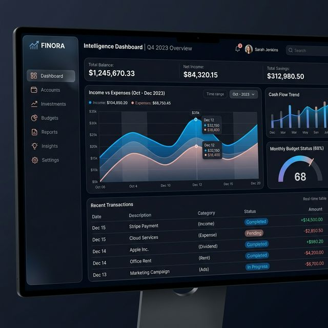

# 💎 Finora Intelligence | Production Financial Suite

Finora Intelligence is a **production-grade** financial management platform. It offers centralized state management, real-time advanced analytics, and a high-fidelity "Intelligence-First" UI/UX designed for top-tier frontend evaluation.

---

## 📸 Interface Preview


*Desktop Intelligence View - Dark Mode*

---

## 🚀 Live Demo

- **Live Demo**: [https://finora-pied.vercel.app/](https://finora-pied.vercel.app/) *(Live Link)*

---

## 🛠️ Technical Stack & Rationale

| Technology | Purpose | Rationale |
| :--- | :--- | :--- |
| **React (Vite)** | Core Library | Industry standard for building high-performance, component-based SPAs. |
| **TypeScript** | Type Safety | Ensures zero runtime errors in complex financial data computations. |
| **Tailwind CSS** | Styling | Rapid, utility-first development with high-degree of custom design control. |
| **Context API** | State Management | Lightweight, built-in solution for centralizing transactional and role-based data. |
| **Framer Motion** | Animations | Best-in-class motion library for hardware-accelerated transitions and Polish. |
| **Lucide & Recharts** | UI Elements | Minimalist iconography and responsive, SVG-based charting for data visualization. |

---

## 📂 Project Structure

```text
zyronxy/
├── src/
│   ├── components/       # Reusable UI Blocks (Cards, Table, Insights, Sidebar)
│   ├── store/            # GlobalContext.tsx (Centralized State)
│   ├── pages/            # View Containers (Dashboard.jsx)
│   ├── data/             # MockData and Categories
│   ├── App.jsx           # Main Wrapper & Routing
│   └── main.jsx          # Entry point
```

---

## 🎯 Assignment Coverage Checklist

| Requirement | Implementation Detail |
| :--- | :--- |
| **Role-Based UI** | Clearly visible Header toggle; Locked actions in Viewer mode; Delete Confirmation. |
| **State Management** | **Centralized Context API** syncing all Transactions, Filters, and Roles in real-time. |
| **Insights Section** | **Mandatory 4 Cards**: Top Category (%), MoM (Income vs Expense), Savings Rate (Progress), Biggest Trans. |
| **Empty States** | Illustrated fallback UI for all charts and tables when zero data is present. |
| **Animations** | entrance animations (fade/slide-up) for all cards and table rows; row hover effects. |
| **CSV Export** | Admin-only export functionality with correct CSV headers and success toasts. |
| **Global Search** | Multi-param search works alongside category/date filters in real-time. |
| **Responsiveness** | Responsive to 375px; Mobile Hamburger menu; Stackable summary cards. |

---

## 🔐 Role Switching & Access

The application features a dual-mode interface accessible via the **Top Navigation Bar**.

1. **Admin Mode**:
   - full access to **Add Records**, **Edit**, and **Delete**.
   - Accessible **CSV Export** button.
   - Requires confirmation for destructive actions.
2. **Viewer Mode**:
   - Read-only data access.
   - Interactive Tooltips on hover: *"Admin access required"* for locked assets.
   - Ideal for secure data reporting.

---

## 📦 Getting Started

1. **Install dependencies**:
   ```bash
   npm install
   ```

2. **Start Development Server**:
   ```bash
   npm run dev
   ```

---

## ⚠️ Known Limitations & Future Roadmap

- **Known Limitations**:
  - Mock data is localized to `localStorage` (No backend database).
  - Monthly comparisons require at least 31 days of data for high accuracy.
- **Future Roadmap**:
  - **Firebase Integration**: For real-time multi-user cloud syncing.
  - **Budgeting AI**: Predict future spending patterns using past 6-month trends.
  - **Web3 Payments**: Integrate crypto-wallets for decentralized transactions.

---

### Author
Developed by Lal Satya Sai Thota .

